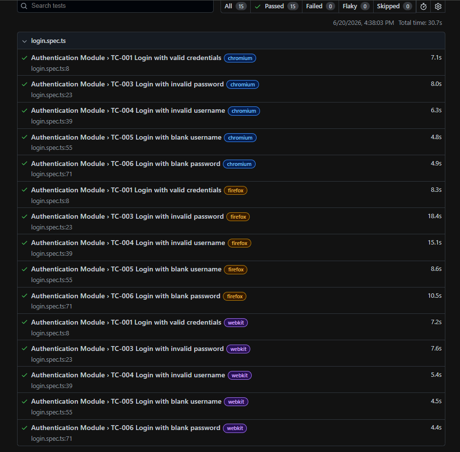

# CRM Lead Management Automation

## Overview

Enterprise-style QA portfolio project demonstrating:

- BRD
- FRS
- RTM
- Test Case Design
- Defect Management
- Playwright Automation

## Tech Stack

- Playwright
- TypeScript
- Node.js
- Page Object Model

## Automated Test Cases

| TC ID | Scenario |
|--------|----------|
| TC-001 | Login with valid credentials |
| TC-003 | Invalid password |
| TC-004 | Invalid username |
| TC-005 | Blank username |
| TC-006 | Blank password |

## Test Execution Summary

15 Passed
0 Failed

## Test Evidence

